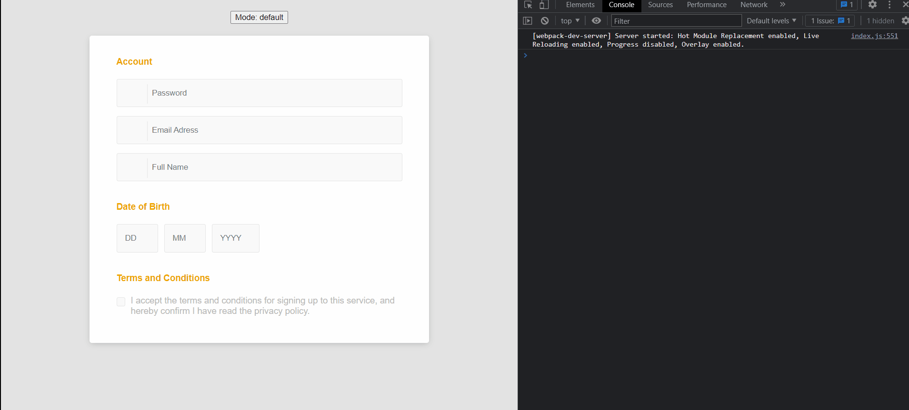

## React Lego

Simple components to help sort your form entries

### How to use

- You need to import the `Box` component to create a context and wrap your inputs to that common region
  - You can have multiple `Box`.
- Each `Box` can have multiple `BoxItem`
  - Each `BoxItem` inside your `Box` can be reordered when the `Box` is in edit mode.

## Box Properties

- **id**: Unique string to identify the Box and BoxItem;
- **mode**: `edit` or `undefined` to allow the user move the items within Box;
- **onOrderChange**: Get an array of `number | null` with a new order of values;
- **dataSource**:
  - **order**: A array with order of items to show on DOM.
    - Index of array represents the position of `BoxItem` on DOM;
    - Value of array is a new position of the `BoxItem`;
    - Ex: [null, 0]
      - A `Box` with two `BoxItem`;
      - The second `Box Item` in the DOM (index 1) will be replaced by the first `BoxItem` in the DOM;
      - `null` is for skip the `BoxItem` swap method on this index.

```tsx
const accountOrder = [null, 1, 0];

return () => (
  <Box
    id='account'
    mode={mode}
    onOrderChange={onOrderChange}
    dataSource={{
      order: accountOrder, // Set a order of inputs when page is loaded
    }}
  >
    <h4>Account</h4>
    <BoxItem>
      <div className='input-group input-group-icon'>
        <input type='text' placeholder='Full Name' />
        <div className='input-icon'>
          <i className='fa fa-user'></i>
        </div>
      </div>
    </BoxItem>
    <BoxItem>
      <div className='input-group input-group-icon'>
        <input type='email' placeholder='Email Adress' />
        <div className='input-icon'>
          <i className='fa fa-envelope'></i>
        </div>
      </div>
    </BoxItem>
    <BoxItem>
      <div className='input-group input-group-icon'>
        <input type='password' placeholder='Password' />
        <div className='input-icon'>
          <i className='fa fa-key'></i>
        </div>
      </div>
    </BoxItem>
  </Box>
);
```

### Example


